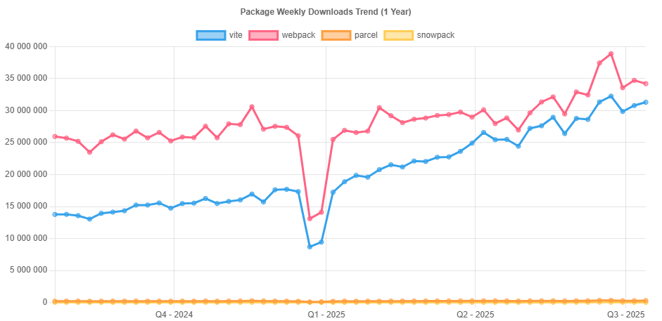
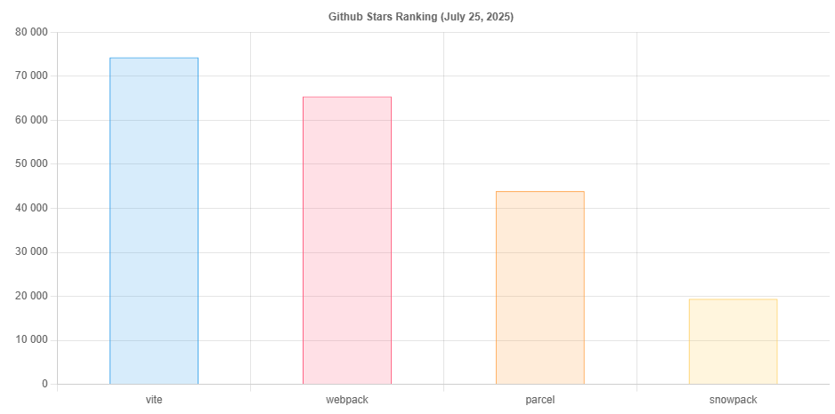
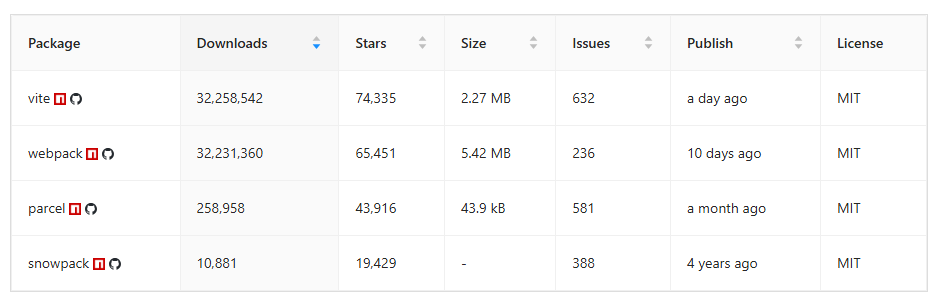

# Bundlers

JavaScript bundlers and build tools are essential in modern web development, enabling developers to optimize their applications by combining multiple files into a single bundle, managing dependencies, and enhancing performance. These tools streamline the development process by automating tasks such as transpilation, minification, and hot module replacement, ultimately improving the efficiency of the development workflow and the performance of the final product. Each tool has its unique features and design philosophies that cater to different project requirements and developer preferences.

## Navigation 
- [Home](../)
- [Back](./)

## Content

1. [Why bundle your code and assets?](#why)
1. [How does bundling work?](#works)
1. [How to choose a bundler?](#choose)
1. [How to use a bundler?](#use)
1. [JavaScript Bundlers and Build Tools Comparison](#comparison)
1. [Links](#links)

##  Why bundle your code and assets?

Bundling your code and assets is advantageous to your web development workflow and performance. This process reduces the number of HTTP requests and file sizes, improving the loading speed and user experience of your web pages. Moreover, it allows you to use modern features, such as ES6 modules, TypeScript, JSX, SCSS, and PostCSS, which can be transpiled into compatible and minified code for older browsers. Additionally, bundling enables you to split your code into smaller chunks and load them on demand, enhancing the scalability and maintainability of your web applications. Furthermore, it simplifies the management of dependencies and versions while automating tasks like linting, testing, and debugging. In short, bundling saves you time and effort while ensuring that your code and assets are consistent and up to date.

##  How does bundling work?

Bundling works by analyzing your entry point file, which is usually an HTML or a JavaScript file that references other files, and creating a dependency graph that shows how your code and assets are related. Then, it applies various transformations, such as transpiling, minifying, hashing, and inlining, to each file in the graph, and outputs a bundle or multiple bundles that contain the optimized code and assets. Depending on the bundler you use, you can customize the output format, the naming convention, the directory structure, and the plugins you want to use.

##  How to choose a bundler?

When selecting a bundler, you should take into account your project requirements, preferences, and experience. Every bundler has its own advantages and disadvantages; however, there are some general factors to consider. The size and complexity of your project can influence which bundler you choose. For instance, larger and more complex projects may need more powerful and flexible bundlers such as Webpack, while smaller and simpler projects may prefer more lightweight and easy-to-use bundlers like Parcel. Additionally, you should look at the features and plugins available with different bundlers. Different bundlers support different features and plugins, such as hot module replacement, code splitting, tree shaking, and source maps. Lastly, you should consider the documentation quality and community support of each bundler. You should choose a bundler that has clear and comprehensive documentation, as well as active and helpful community forums and resources.

##  How to use a bundler?

Using a bundler usually involves three steps: installing, configuring, and running. Depending on the bundler you choose, the exact steps may vary. Generally, you need to install the bundler and its dependencies, such as Node.js and npm, on your local machine. You can do this with the command line or a package manager like npm or yarn. Then, you must create and edit a configuration file in your project folder, such as webpack.config.js or parcel.config.json. This file contains settings and options that tell the bundler how to process your code and assets, such as the entry point, output path, plugins, and loaders. Finally, you need to run the bundler in your command line or terminal using commands like webpack or parcel. Additionally, you can use scripts like npm scripts or gulp tasks to run the bundler with different modes and options like development or production.

##  JavaScript Bundlers and Build Tools Comparison

### TL;DR
- **Parcel** is ideal if you want quick and simple startup with minimal special requirements..
- **Vite** recommended if speed is important, and you still want decent control..
- **Webpack** for complex projects where maximum control and stability outweigh startup speed.

### vite vs webpack vs parcel vs snowpack

#### Package Weekly Downloads Trend

#### Github Stars Ranking

#### Stat Detail

#### Feature Comparison

Configuration

- **vite**: Vite offers a simple configuration setup, allowing developers to get started quickly while providing options for customization as needed, balancing ease of use with flexibility.
- **webpack**: Webpack is highly configurable, requiring a detailed configuration file that allows for extensive customization of the build process, making it suitable for complex applications but potentially overwhelming for newcomers.
- **parcel**: Parcel requires minimal configuration, automatically detecting and optimizing files based on their types, making it very user-friendly for beginners and small projects.
- **snowpack**: Snowpack uses a simple configuration file to define entry points and build settings, focusing on a straightforward setup that emphasizes speed and efficiency.

Development Speed

- **vite**: Vite provides an incredibly fast development experience with instant server start and hot module replacement, allowing developers to see changes in real-time without full page reloads.
- **webpack**: Webpack can be slower in development due to its bundling process, but with proper configuration and optimizations like caching, it can still provide reasonable speeds for larger applications.
- **parcel**: Parcel boasts fast build times due to its parallel processing capabilities and automatic optimizations, making it a great choice for rapid development cycles.
- **snowpack**: Snowpack offers near-instant server start times and fast refresh capabilities, leveraging native ES modules to improve development speed significantly compared to traditional bundlers.

Ecosystem and Plugins

- **vite**: Vite has a rapidly growing ecosystem with a strong focus on modern frameworks like Vue and React, offering numerous plugins and integrations to enhance development.
- **webpack**: Webpack has a mature and extensive ecosystem with a vast array of plugins and loaders, making it highly adaptable for various project requirements and use cases.
- **parcel**: Parcel has a growing ecosystem with a variety of plugins available, but it may not be as extensive as Webpack's, which could limit certain advanced use cases.
- **snowpack**: Snowpack supports a range of plugins and integrations, particularly for modern web technologies, but its ecosystem is still developing compared to more established tools.

Learning Curve

- **vite**: Vite is also beginner-friendly, offering a straightforward setup and intuitive development experience, making it easy to learn for newcomers to modern web development.
- **webpack**: Webpack has a steep learning curve due to its complexity and extensive configuration options, which can be challenging for beginners but provides powerful capabilities for advanced users.
- **parcel**: Parcel is designed for ease of use, making it beginner-friendly with a gentle learning curve, allowing developers to focus on building rather than configuration.
- **snowpack**:
Snowpack has a relatively low learning curve, especially for those familiar with ES modules, making it accessible for developers transitioning from traditional bundlers.

Performance Optimization

- **vite**: Vite optimizes performance by serving files over native ESM during development and generating optimized builds for production, ensuring fast load times and efficient resource management.
- **webpack**: Webpack provides powerful optimization features, including code splitting, tree shaking, and various performance tuning options, allowing developers to fine-tune their builds for maximum efficiency.
- **parcel**: Parcel automatically optimizes builds for production, including code splitting and tree shaking, which helps improve performance without requiring extensive manual configuration.
- **snowpack**: Snowpack optimizes builds by leveraging native ES modules, enabling faster loading times and smaller bundle sizes, particularly beneficial for modern web applications.

#### How to Choose: vite vs webpack vs parcel vs snowpack

- **vite**: Choose Vite for its fast development experience, leveraging native ES modules and providing instant server start and hot module replacement, making it suitable for large applications and projects that require quick iteration.
- **webpack**: Choose Webpack if you need a highly configurable and powerful tool that can handle complex build processes, allowing for extensive customization and optimization suited for large-scale applications.
- **parcel**: Choose Parcel if you want a zero-configuration setup that automatically handles file types and optimizes your assets, making it ideal for smaller projects or rapid prototyping.
- **snowpack**:  Choose Snowpack if you prefer a modern approach with a focus on speed and simplicity, leveraging native ES modules for development and building optimized production bundles with minimal configuration.

##  Links
1. [linkedin ai suggest](https://www.linkedin.com/advice/1/what-purpose-bundler-front-end-development-skills-web-development-yrznf)
1. [npm-compare](https://npm-compare.com/parcel,snowpack,vite,webpack)

## Navigation 
- [Home](../)
- [Back](./)