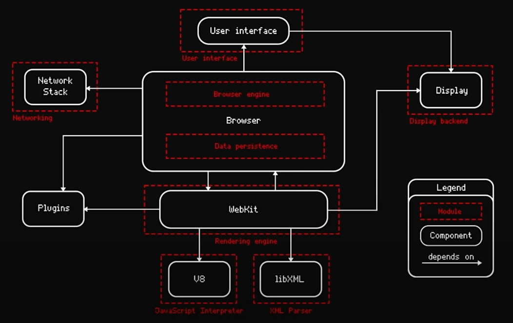
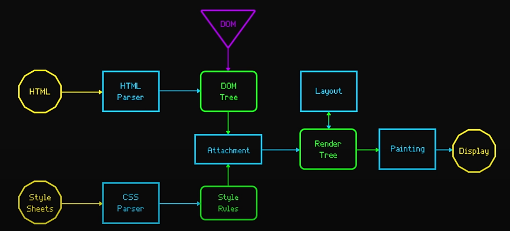

# Browser Architecture

Browser architecture is designed to provide a faster, more secure, and more feature-rich platform that helps users interact easily with the internet. The browser architecture is broadly divided into seven parts.

- **The user interface** of a browser is designed such that it allows personalization, as every individual has different interests. This personalization is achieved by providing basic features like groups, collections, bookmarks, and themes. Each browser can have a different user interface and features.
- **Browser Engine:** The browser engine is responsible for coordinating web content that is fetched from the server and user interactions. It keeps a note of which button is clicked, which URL is asked to parse, and how the web content will be processed and displayed on the browser.
- **Rendering Engine:** The rendering engine, on the other hand, interprets and renders web content. In most browsers, both the browser engine and the rendering engine work together to provide better results to the user.
- **Networking Layer:** This layer handles the communication part. When the user enters or clicks on a URL, the network layer initiates an HTTP request to the webserver to load the requested web page. It also manages fetching resources from HTML files, images, stylesheets, and more. Have you seen those cookie notifications while searching for information on the internet? Mostly, the network layer works behind the scenes for those cookies and cache.
- **JavaScript Engine:** The JavaScript Engine is the core component of browser architecture, with the ability to manipulate web content and introduce dynamic behavior in web pages. V8 for chrome, Gecko for firefox, JavascriptCore (also known SquirrelFish, SquirrelFish Extreme, Nitro, Nitro Extreme) for safari
- **Data Storage:** A large part of the browser goes into storing various types of data, which include not only user preferences, browsing history, passwords, and other regular data updates as well (address, name, and contact).
- **UI backend:** The UI backend provides dynamic and interactive behavior on the web page and enhances the overall functionality and performance of the browser.

## Examples

Google Chrome architecture:

Mozilla Firefox architecture:

## Webkit render engine architecture

## Resources

1. [geeksforgeeks](https://www.geeksforgeeks.org/software-engineering/browser-architecture/)
2. [Ulbi TV Youtube channel](https://www.youtube.com/watch?v=zDlg64fsQow)