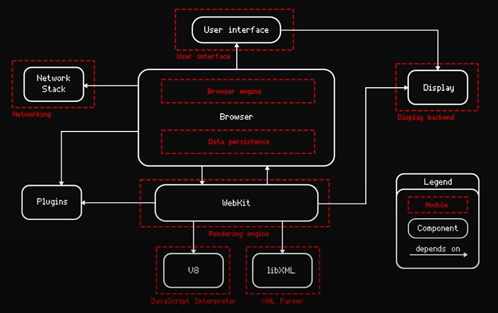

# Browser

A web browser, often shortened to browser, is an application for accessing websites. When a user requests a web page from a particular website, the browser retrieves its files from a web server and then displays the page on the user's screen. Browsers can also display content stored locally on the user's device.

## Navigation 
- [Home](../)
- [Back](./)

## Content

1. [Browser Architecture](#architecture)
1. [Architecture Examples](#examples)
1. [Role of Rendering Engine](#renderrole)
1. [Resources](#resources)

##  Browser Architecture

Browser architecture is designed to provide a faster, more secure, and more feature-rich platform that helps users interact easily with the internet. The browser architecture is broadly divided into seven parts.

- **The user interface** of a browser is designed such that it allows personalization, as every individual has different interests. This personalization is achieved by providing basic features like groups, collections, bookmarks, and themes. Each browser can have a different user interface and features.
- **Browser Engine:** The browser engine is responsible for coordinating web content that is fetched from the server and user interactions. It keeps a note of which button is clicked, which URL is asked to parse, and how the web content will be processed and displayed on the browser.
- **Rendering Engine:** The rendering engine, on the other hand, interprets and renders web content. In most browsers, both the browser engine and the rendering engine work together to provide better results to the user. 
Blink: Google's Blink engine is part of the Chromium project and is used in browsers like Chrome and Opera. 
Gecko: Developed by Mozilla, Gecko powers the Firefox browser. 
WebKit: Developed by Apple, WebKit is used in Safari and other Apple products. 
- **Networking Layer:** This layer handles the communication part. When the user enters or clicks on a URL, the network layer initiates an HTTP request to the webserver to load the requested web page. It also manages fetching resources from HTML files, images, stylesheets, and more. Have you seen those cookie notifications while searching for information on the internet? Mostly, the network layer works behind the scenes for those cookies and cache.
- **JavaScript Engine:** The JavaScript Engine is the core component of browser architecture, with the ability to manipulate web content and introduce dynamic behavior in web pages. V8 for chrome, SpiderMonkey for firefox, JavascriptCore (also known SquirrelFish, SquirrelFish Extreme, Nitro, Nitro Extreme) for safari
- **Data Storage:** A large part of the browser goes into storing various types of data, which include not only user preferences, browsing history, passwords, and other regular data updates as well (address, name, and contact).
- **UI backend:** The UI backend provides dynamic and interactive behavior on the web page and enhances the overall functionality and performance of the browser.

##  Architecture Examples

Google Chrome architecture:

Mozilla Firefox architecture:

##  Role of Rendering Engine

Once a user requests a particular document, the rendering engine starts fetching the content of the requested document. This is done via the networking layer. The rendering engine starts receiving the content of that specific document in chunks of 8 KBs from the networking layer. After this, the basic flow of the rendering engine begins.

The four basic steps include:

1. The requested HTML page is parsed in chunks, including the external CSS files and in style elements, by the rendering engine. The HTML elements are then converted into DOM nodes to form a “content tree” or “DOM tree.”
1. Simultaneously, the browser also creates a render tree. This tree includes both the styling information as well as the visual instructions that define the order in which the elements will be displayed. The render tree ensures that the content is displayed in the desired order.
1. Further, the render tree goes through the layout process. When a render tree is created, the position or size values are not assigned. The entire process of calculating values for evaluating the desired position is called a layout process. In this process, every node is assigned the exact coordinates. This ensures that every node appears at an accurate position on the screen.
1. The final step is to paint the screen, wherein the render tree is traversed, and the renderer’s paint() method is invoked, which paints each node on the screen using the UI backend layer.

another visualization

### <ins>*Render is expensive operation*</ins>

### What triggers the rerender

1. Resize
1. Font change
1. Change content
1. add/remove classes/styles
1. DOM manipulation
1. Change orientation (portrait, landscape)
1. Change size/position
1. Calculation size/position

## Webkit render engine architecture

##  Resources

1. [geeksforgeeks](https://www.geeksforgeeks.org/software-engineering/browser-architecture/)
1. [Ulbi TV Youtube channel](https://www.youtube.com/watch?v=zDlg64fsQow)
1. [browserstack](https://www.browserstack.com/guide/browser-rendering-engine)

## Navigation 
- [Home](../)
- [Back](./)
